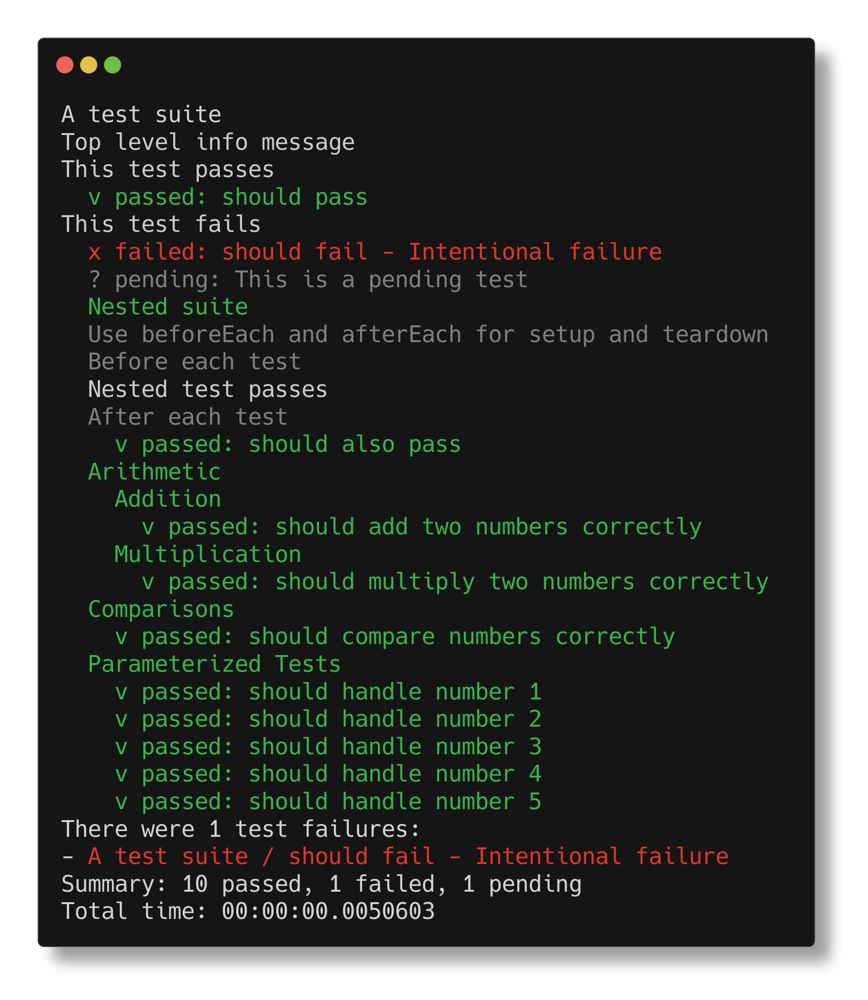

<p align="center">

</p>

# 🌱 Sprout: BDD Testing for F#

> *Sprout is a lightweight F# test DSL with a clean, composable structure built on computation expressions. This allows your test suites to grow almost organically - i.e. sprout.*

[](https://github.com/dlidstrom/Sprout/actions/workflows/build.yml)

## ✅ Features

* Minimalist & expressive BDD-style syntax
* Nestable `describe` blocks for organizing tests to any depth or complexity
* Computation expressions for `it`, `beforeEach`, `afterEach`
* Asynchronous blocks supported
* Pending tests support
* Logging for improved traceability
* Built-in assertions: `shouldEqual`, `shouldBeTrue`, `shouldBeFalse`
  * These go along way to making your tests readable and expressive due to the
    descriptive text that goes along with each `describe` block and `it` test
    case. Note that you may use any exception-based constraints library if
    desired ([FsUnit.Light](https://github.com/Lanayx/FsUnit.Light) works
    beautifully).
* Support for parameterized tests using normal F# loops within `describe` blocks
* Pluggable reporters (console, silent, TAP, JSON)
* Built for F# — simple and idiomatic
  * No need for `<|` or functions wrapped in parentheses!
  * No need for complex combination of attributes - it's just all F# code!

Sprout provides a clean API for structuring tests. There are a minimum of
abstractions. `describe` blocks may be nested to any suitable depth. It is all
just a matter of *composing* the building blocks. Just like you would expect
coming from a functional programming background.

---

### 🚀 Getting Started

```bash
dotnet add package Sprout
```

> Sprout is currently only available from [GitHub Packages](https://github.com/dlidstrom/Sprout/pkgs/nuget/Sprout).

---

### 🧪 Example Test

```fsharp
open Sprout

let suite = describe "A test suite" {
  Info "Top level info message"

  // variables may be used to store state across tests
  let mutable b = false
  beforeEach { b <- true }
  it "should pass" {
    info "This test passes"

    // simple assertions included out-of-the-box
    b |> shouldBeTrue
  }

  it "should fail" {
    info "This test fails"
    failwith "Intentional failure"
  }

  // use pending to mark tests that are not yet implemented
  pending "This is a pending test"

  describe "Async works too" {
    Debug "Async test example"

    // asynchronous flows are supported
    it "should run asynchronously" {
      do! Async.Sleep 1000
      info "Async test completed"
    }
  }

  // use nested suites to organize tests
  describe "Arithmetic" {
    describe "Addition" {
      it "should add two numbers correctly" {
        let result = 2 + 2
        result |> shouldEqual 4
      }
    }

    describe "Multiplication" {
      it "should multiply two numbers correctly" {
        let result = 3 * 3
        result |> shouldEqual 9
      }
    }

    describe "Comparisons" {
      debug "Testing comparisons"
      it "should compare numbers correctly" {
        5 > 3 |> shouldBeTrue
      }
    }

    // parameterized tests are supported using regular F# loops
    // type-safe as expected without any special syntax
    describe "Parameterized Tests" {
      info "Simply embed test cases and loop over them"
      let numbers = [1; 2; 3; 4; 5]
      for n in numbers do
        it $"should handle number {n}" {
          n > 0 |> shouldBeTrue
        }
    }
  }
}

// Run the test suite asynchronously
runTestSuite
|> Async.RunSynchronously
```

Output:



---

### 📦 Blocks

| Name | Usage | Supported Expressions |
|-|-|-|
| `describe` | Declarative | `it`, `beforeEach`, `afterEach`, `it`, `Info`, `Debug` |
| `it` | Imperative | Any F# expressions, but typically exception-based assertions |
| `beforeEach`, `afterEach` | Imperative | Hook functions that run before and after test cases, respectively |

* **`describe`** - used to define a test suite, or a group of tests. Use the
  descriptive text to create descriptive sentences of expected behaviour.
* **`it`** - used to define test assertions, along with a descriptive text to
  define the expected behaviour
* **`beforeEach`/`afterEach`** - hook functions that run before and after test
  cases, respectively
* **`pending`** - used to denote a pending test case
* **`info`/`debug`** - tracing functions that may be used inside hook functions
  and `it` blocks
* **`Info`/`Debug`** - constructor functions that provide tracing inside
  `describe` blocks

> Tracing works slightly different in `describe` blocks due to limitations of me
> (most likely) and/or F# computation expressions.

---

### 🧩 Extending Sprout

You can plug in your own reporter:

```fsharp
type MyCustomReporter() =
  interface ITestReporter with
    member _.Begin(totalCount) = ...
    member _.BeginSuite(name, path) = ...
    member _.ReportResult(result, path) = ...
    member _.EndSuite(name, path) = ...
    member _.Info(message, path) = ...
    member _.Debug(message, path) = ...
    member _.End(testResults) = ...
```

Use it like this:

```fsharp
let reporter = MyCustomReporter()
let results =
  runTestSuiteWithContext
    suite
    { TestContext.New with Reporter = reporter }
```

Available reporters (available in the `Sprout.Reporters` namespace):

| Reporter | Description |
| -------- | ----------- |
| `ConsoleReporter` | Outputs test results to the console |
| `TapReporter` | Outputs test results in TAP format |

---

### 📦 Package Info

|         |                             |
| ------- | --------------------------- |
| NuGet   | [`Sprout`](https://github.com/dlidstrom/Sprout/pkgs/nuget/Sprout) |
| Target  | .NET Standard 2.0.          |
| License | MIT                         |
| Author  | Daniel Lidström             |
