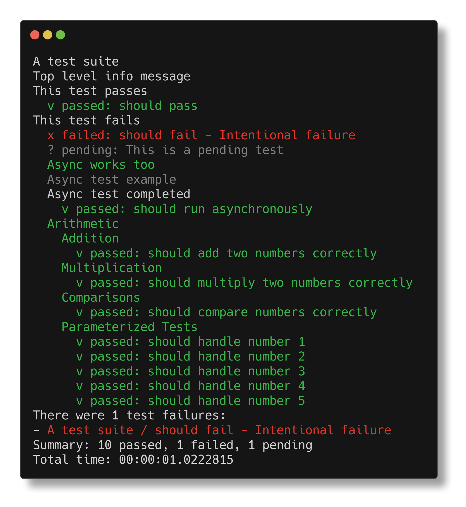

<p align="center">

</p>

# Sprout: BDD Testing for F#

> *Write your tests like your thoughts. Sprout is a lightweight F# test DSL with a clean, composable structure built on computation expressions.*

[](https://github.com/dlidstrom/Sprout/actions/workflows/build.yml)

## ✅ Features

* Minimalist & expressive BDD-style syntax
* Nestable `describe` blocks
* Computation expressions for `it`, `beforeEach`, `afterEach`
* Pending tests supported by omission
* Logging for improved tracing
* Pluggable reporters (console, silent, TAP, JSON)
* Built for F# — no extra syntax or matchers

---

### 🚀 Getting Started

```bash
dotnet add package Sprout
```

---

### 🧪 Example Test

```fsharp
open Sprout

let suite = describe "A test suite" {
  Info "Top level info message"
  it "should pass" {
    info "This test passes"
  }

  it "should fail" {
    info "This test fails"
    failwith "Intentional failure"
  }

  pending "This is a pending test"

  describe "Nested suite" {
    Debug "Use beforeEach and afterEach for setup and teardown"
    beforeEach {
      debug "Before each test"
    }

    afterEach {
      debug "After each test"
    }
    it "should also pass" {
      info "Nested test passes"
    }
  }

  describe "Arithmetic" {
    describe "Addition" {
      it "should add two numbers correctly" {
        let result = 2 + 2
        result |> shouldEqual 4
      }
    }

    describe "Multiplication" {
      it "should multiply two numbers correctly" {
        let result = 3 * 3
        result |> shouldEqual 9
      }
    }
  }

  describe "Comparisons" {
    debug "Testing comparisons"
    it "should compare numbers correctly" {
      5 > 3 |> shouldBeTrue
    }
  }

  describe "Parameterized Tests" {
    info "Simply embed test cases and loop over them"
    let numbers = [1; 2; 3; 4; 5]
    for n in numbers do
      it $"should handle number {n}" {
        n > 0 |> shouldBeTrue
      }
  }
}
```

Output:



---

### 🧩 Extending Sprout

You can plug in your own reporter:

```fsharp
type MyCustomReporter() =
  interface ITestReporter with
    member _.BeginSuite(name, path) = ...
    member _.ReportResult(result, path) = ...
    member _.EndSuite(name, path) = ...
    member _.Info(message, path) = ...
    member _.Debug(message, path) = ...
    member _.End(testResults) = ...
```

---

### 🎯 Philosophy

Sprout is built on:

* **F# idioms** — computation expressions
* **Extensibility** — pluggable reporters and hooks

### Blocks

| Name | Usage | Supported Expressions |
|-|-|-|
`describe` | Declarative | `it`, `beforeEach`, `afterEach`, `it`, `Info`, `Debug` |
| `it` | Imperative | Any F# expressions, but typically exception-based assertions |

---

### 📦 Package Info

|         |                             |
| ------- | --------------------------- |
| NuGet   | `Sprout`                    |
| Target  | .NET Standard 2.0.          |
| License | MIT                         |
| Author  | Daniel Lidström             |
